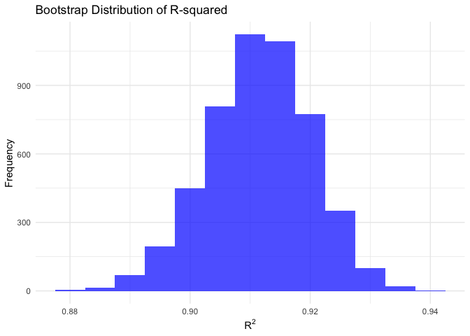
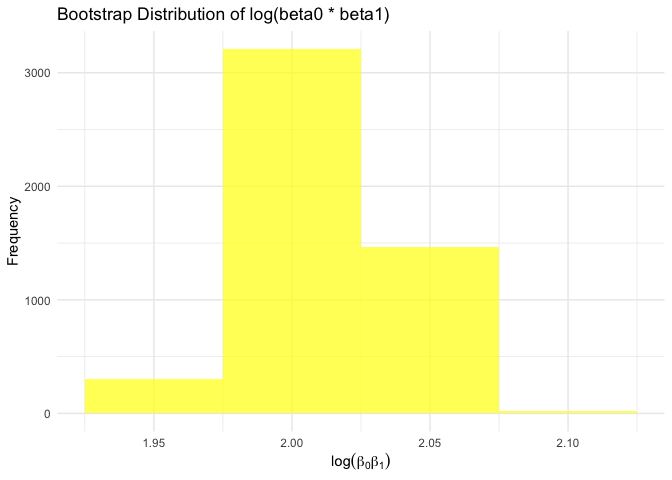
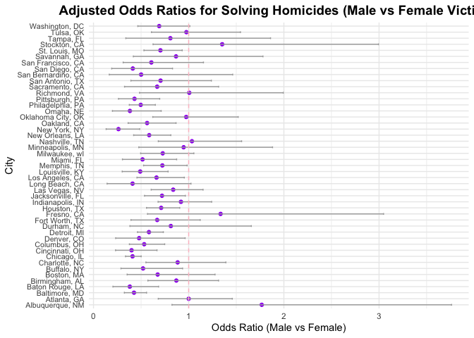

P8105 Homework 6
================
November 23, 2024

## Problem 1

``` r
weather_df = 
  rnoaa::meteo_pull_monitors(
    c("USW00094728"),
    var = c("PRCP", "TMIN", "TMAX"), 
    date_min = "2017-01-01",
    date_max = "2017-12-31") %>%
  mutate(
    name = recode(id, USW00094728 = "CentralPark_NY"),
    tmin = tmin / 10,
    tmax = tmax / 10) %>%
  select(name, id, everything())
```

    ## using cached file: /Users/Tammy/Library/Caches/org.R-project.R/R/rnoaa/noaa_ghcnd/USW00094728.dly

    ## date created (size, mb): 2024-09-26 20:34:18.576194 (8.651)

    ## file min/max dates: 1869-01-01 / 2024-09-30

Perform 5000 bootstrap samples and fit linear models

``` r
bootstrap_results <- weather_df %>%
  modelr::bootstrap(n = 5000, id = "bootstrap_id") %>%
  mutate(
    models = map(strap, ~ lm(tmax ~ tmin, data = .x)),
    # Extract R-squared
    r_squared = map_dbl(models, ~ glance(.x)$r.squared),
    # Compute log(beta0 * beta1)
    log_beta_product = map_dbl(models, ~ {
      coefs <- tidy(.x)$estimate
      log(coefs[1] * coefs[2])
    })
  )
```

Compute confidence intervals

``` r
ci_results <- bootstrap_results %>%
  summarise(
    r_squared_lower = quantile(r_squared, 0.025),
    r_squared_upper = quantile(r_squared, 0.975),
    log_beta_lower = quantile(log_beta_product, 0.025),
    log_beta_upper = quantile(log_beta_product, 0.975)
  )
```

The 95% confidence interval for r squared is 0.8940297, 0.9273455. The
95% confidence interval for log(beta0\*beta1) is 1.9654539, 2.0577241

Plot distributions R-squared distribution

``` r
r_squared_plot <- ggplot(bootstrap_results, aes(x = r_squared)) +
  geom_histogram(binwidth = 0.005, fill = "blue", alpha = 0.7) +
  labs(
    title = "Bootstrap Distribution of R-squared",
    x = expression(R^2),
    y = "Frequency"
  ) +
  theme_minimal()
```

Log(beta0 \* beta1) distribution

``` r
log_beta_plot <- ggplot(bootstrap_results, aes(x = log_beta_product)) +
  geom_histogram(binwidth = 0.05, fill = "yellow", alpha = 0.7) +
  labs(
    title = "Bootstrap Distribution of log(beta0 * beta1)",
    x = expression(log(beta[0] * beta[1])),
    y = "Frequency"
  ) +
  theme_minimal()
```

Display the plots

``` r
print(r_squared_plot)
```

<!-- -->

``` r
print(log_beta_plot)
```

<!-- -->

The bootstrap distribution of R² is slightly skewed to the right, with
most values falling between 0.89 and 0.93 and a mode near 0.91,
suggesting a strong and consistent model fit across different samples.
The distribution of log(β₀β₁) is approximately symmetric and normally
distributed, centered around 2.00, indicating stable relationships
between the intercept and slope across re-samples.

# Problem 2

Import data and clean

``` r
homicide_data = read.csv("data/homicide-data.csv")
```

``` r
homicide_data_clean <- homicide_data |>
  clean_names() |>
  mutate(
    city_state = paste(city, state, sep = ", "),
    victim_age = na_if(victim_age, "Unknown"),
    victim_age = as.numeric(victim_age),
    homicide_solved = ifelse(disposition == "Closed by arrest", 1, 0)
  ) |>
  filter(
    !city_state %in% c("Dallas, TX", "Phoenix, AZ", "Kansas City, MO", "Tulsa, AL"),
    victim_race %in% c("White", "Black")
  )
```

Logistic Regression for Baltimore, MD

``` r
baltimore_data <- homicide_data_clean |>
  filter(city_state == "Baltimore, MD")

baltimore_model <- glm(
  homicide_solved ~ victim_age + victim_sex + victim_race,
  data = baltimore_data,
  family = binomial()
)

baltimore_results <- broom::tidy(baltimore_model, conf.int = TRUE, exponentiate = TRUE) |>
  filter(term == "victim_sexMale") |>
  select(term, OR = estimate, CI_lower = conf.low, CI_upper = conf.high)
```

Logistic Regression Across All Cities

``` r
city_results <- homicide_data_clean |>
  group_by(city_state) |>
  nest() |>
  mutate(
    model = map(data, ~ glm(homicide_solved ~ victim_age + victim_sex + victim_race, data = .x, family = binomial())),
    results = map(model, ~ broom::tidy(.x, conf.int = TRUE, exponentiate = TRUE))
  ) |>
  unnest(results) |>
  filter(term == "victim_sexMale") |>
  select(city_state, OR = estimate, CI_lower = conf.low, CI_upper = conf.high)
```

    ## Warning: There were 45 warnings in `mutate()`.
    ## The first warning was:
    ## ℹ In argument: `results = map(model, ~broom::tidy(.x, conf.int = TRUE,
    ##   exponentiate = TRUE))`.
    ## ℹ In group 1: `city_state = "Albuquerque, NM"`.
    ## Caused by warning:
    ## ! glm.fit: fitted probabilities numerically 0 or 1 occurred
    ## ℹ Run `dplyr::last_dplyr_warnings()` to see the 44 remaining warnings.

``` r
city_results
```

    ## # A tibble: 47 × 4
    ## # Groups:   city_state [47]
    ##    city_state         OR CI_lower CI_upper
    ##    <chr>           <dbl>    <dbl>    <dbl>
    ##  1 Albuquerque, NM 1.77     0.825    3.76 
    ##  2 Atlanta, GA     1.00     0.680    1.46 
    ##  3 Baltimore, MD   0.426    0.324    0.558
    ##  4 Baton Rouge, LA 0.381    0.204    0.684
    ##  5 Birmingham, AL  0.870    0.571    1.31 
    ##  6 Boston, MA      0.674    0.353    1.28 
    ##  7 Buffalo, NY     0.521    0.288    0.936
    ##  8 Charlotte, NC   0.884    0.551    1.39 
    ##  9 Chicago, IL     0.410    0.336    0.501
    ## 10 Cincinnati, OH  0.400    0.231    0.667
    ## # ℹ 37 more rows

This table summarizes the odds ratio, and lower and upper confidence
intervals for each city.

Plotting Adjusted Odds Ratios

``` r
city_results |>
  mutate(city_state = reorder(city_state, OR)) |>
  ggplot(aes(x = OR, y = city_state)) +
  geom_point(color = "purple") +
  geom_errorbarh(aes(xmin = CI_lower, xmax = CI_upper), height = 0.3, color = "darkgray") +
  geom_vline(xintercept = 1, linetype = "dashed", color = "pink") +
  labs(
    title = "Adjusted Odds Ratios for Solving Homicides (Male vs Female Victims)",
    x = "Odds Ratio (Male vs Female)",
    y = "City"
  ) +
  theme_minimal() +
  theme(
    axis.text.y = element_text(size = 8),
    plot.title = element_text(hjust = 0.5, face = "bold", size = 14)
  )
```

<!-- -->

Most cities have an odds ratio (OR) less than 1, suggesting that
homicides involving female victims are more likely to be solved compared
to male victims. Cities with an OR greater than 1 indicate that
homicides involving male victims are more likely to be solved compared
to female victims. The two cities with an OR = 1 are Richmond, CA and
Atlanta, GA. This OR indicates no difference in the likelihood of
solving homicides based on victim sex.
